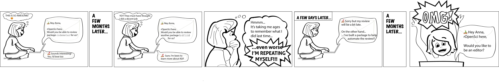
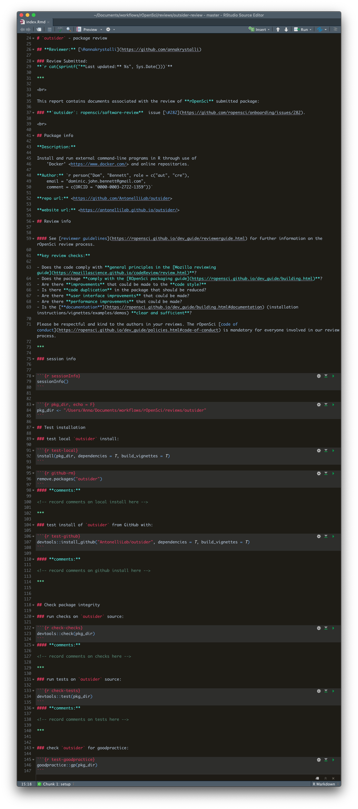
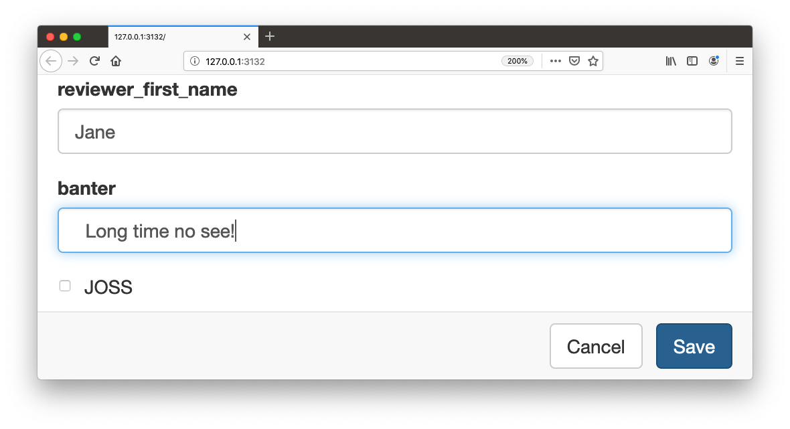
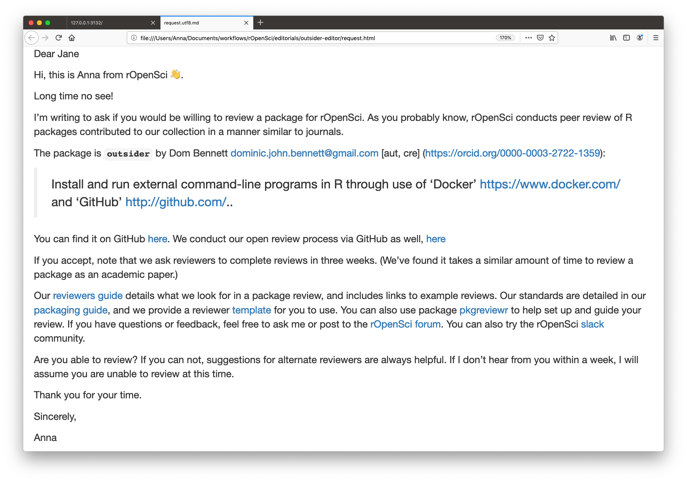

---
author:
  - name: Anna Krystalli
    main: true
    twitter: annakrystalli
    email: a.krystalli@sheffield.ac.uk
    orcid: 0000-0002-2378-4915
    affil: 1, 2
affiliation: 
  - num: 1
    address: University of Sheffield RSE
  - num: 2
    address: Editor, rOpenSci
author_textsize: 3em
primary_colour: "#6faef5"
secondary_colour: "white"
accent_colour: "#F53D68"
font_family: "Crimson Text"
main_findings:
  - "**pkgreviewr** <br>"
  - "<small>supporting **rOpenSci package reviews** through _guidance, automation and templating_</small>"
  - ""
main_textsize: "120px"
main_textcol: "black"
logoleft_name: assets/icon_letterring_color.svg
logoright_name: assets/rse-sheffield-logo.png
logocenter_name: assets/pkgreviewr_QR.png
main_topsize: 0.25 #percent coverage of the poster
logocenter_width: 0.05 # percent of width
main_bottomsize: 0.05
body_textsize: "35px"
output:
  posterdown::posterdown_betterport:
    self_contained: false
    pandoc_args: --mathjax
    number_sections: false
    highlight: pygments

---

```{r setup, include=FALSE}
knitr::opts_chunk$set(echo = TRUE)
```


# rOpenSci software review

### rOpenSci curate R software to help scientists access, download, manage, and archive scientific data in open, reproducible ways.

<br>

## Q: How do we...

- Ensure the quality of code written by scientists without formal training in software development practices? 
- Drive adoption of best practices among our contributors?
- Create a community that would support each other?

## A: Through Open Peer Review!


## **<https://github.com/ropensci/software-review>**

<center>


</center>

<br>

# pkgreviewr `r emo::ji("package")`

### R package to help guide the review process through automation and templating.

### **<https://github.com/ropenscilabs/pkgreviewr>**

***

## Install package

```{r, eval=FALSE}
remotes::install_github("ropenscilabs/pkgreviewr")
```

## Initialise review

```{r, eval=FALSE}
pkgreviewr::pkgreview_create(
    pkg_repo = "AntonelliLab/outsider", 
    review_parent = "~/Documents/reviews/")
```

```
cloning into '/var/folders/8p/87cqdx2s34vfvcgh04l6z72w0000gn/T/
RtmpFQv2Iv/pkgreviewr_prep/outsider'...
Receiving objects: 100% (2379/2379), 1493 kb, done.
✔ Package source cloned successfully
✔ pkg_dir written out successfully
✔ review project 'outsider-review' initialised successfully
✔ Initialising Git repo
✔ Adding files and committing
✔ review_dir written out successfully

```


## `pkgreview_create()` actions:

- **Clones `r emo::ji("package")` source code**
- **Initialises Review project:**

```
.
├── outsider [20 entries exceeds filelimit]
└── outsider-review
    ├── README.md
    ├── index.Rmd
    ├── outsider-review.Rproj
    └── review.md
```

# Anatomy of a review project

+ **`index.Rmd`**: interactive parametarised workbook prepopulated with major steps required to complete the review. 
+ **`pkgreview.md`**: up-to-date review response template to submit to the package rOpenSci software review issue.
+ **`README.md`**: prepopulated review repo README. 


## `index.Rmd`



# pkgreviewr for editors

## Initialise editorial checks

Before going to review, packages need to pass initial editor's checks. `pkgreviewr` can help!

```{r, eval=FALSE}
pkgreviewr::pkgreview_create(
    pkg_repo = "AntonelliLab/outsider", 
    review_parent = "~/Documents/editorials/",
    template = "editor",
    issue_no = 282)
```

```
.
├── editor.md
├── index.Rmd
├── outsider-editor.Rproj
└── request.Rmd
```

## Invite reviewers

Next stage is to find reviewers. `pkgreviewr` provides functionality for generating prepopulated invitations to review, ready to email out!

```{r, eval=FALSE}
pkgreviewr::render_request()
```

```
Loading required package: shiny
Listening on http://127.0.0.1:3132
```




```

processing file: request.Rmd
  |.....................................................| 100%
   inline R code fragments
   
Output created: request.html

```
